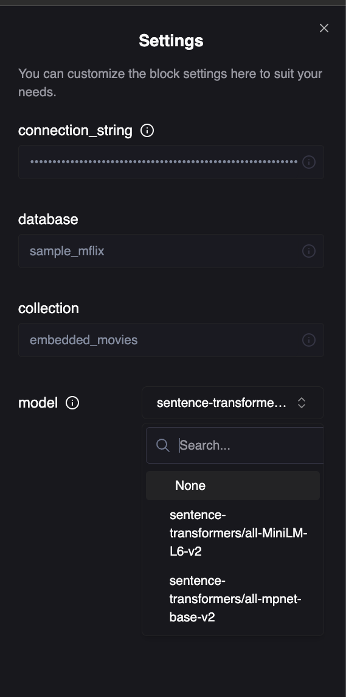
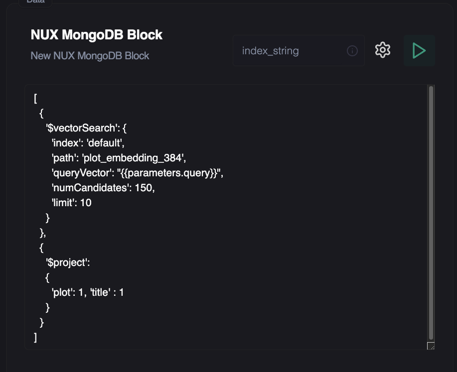

### Selecting an Embedding Model

The easiest option here is to select amongst Huggingface's `SentenceTransformers` library, this allows you to pop it into your python code via:

```python
from sentence_transformers import SentenceTransformer

model = SentenceTransformer('sentence-transformers/all-minilm-l6-v2')
```

Select an embedding model amongst the list here: https://huggingface.co/models?pipeline_tag=sentence-similarity&sort=downloads


### Creating a MongoDB Vector Index

Depending on the embedding model you selected, you'll need to define the index definition. So if the model is 768 dimensions, you'll specifigy it like:

```json
{
  "mappings": {
    "dynamic": true,
    "fields": {
      "plot_embedding_768": {
        "dimensions": 768,
        "similarity": "euclidean",
        "type": "knnVector"
      }
    }
  }
}
```

`plot_embedding_768` in this case is any field that contains the 768 dimension array. 

Consult the MongoDB Vector search docs to understand the various similarity options of `euclidian`, `dotproduct` and `cosine`.

https://www.mongodb.com/docs/atlas/atlas-vector-search/vector-search-stage/#atlas-vector-search-index

### Indexing Data

Using the SentenceTransformer imported above, iterate through whichever dataset you want, encode each and simply insert.  

<Note>Make sure the field you're inserting the encoded array into is the same dimension count</Note>

```python
from pymongo import MongoClient
from sentence_transformers import SentenceTransformer
import asyncio
from dotenv import load_dotenv
import os

load_dotenv()

# Initialize the SentenceTransformer
model = SentenceTransformer('sentence-transformers/all-minilm-l6-v2')

# Grab connection string from env variabl
connection_string = os.getenv('mdb')

# Connect to MongoDB and use default loaded data
client = MongoClient(connection_string)
db = client['sample_mflix']
collection = db['embedded_movies']


async def encode(self, text):
    loop = asyncio.get_event_loop()
    embedding = await loop.run_in_executor(None, model.encode, [text])
    return embedding[0].tolist()


# Get all documents
documents = collection.find()

# Update each document
for doc in documents:
    print(doc['title'])
    if 'plot' not in doc:
        continue
    embedding = model.encode([doc['plot']])[0].tolist()
    collection.update_one(
        {'_id': doc['_id']},
        {'$set': {'plot_embedding_768': embedding}}
    )
```

### Building your Workbook

1. First add the MongoDB block:


2. Then specify the embedding model you'll use

Provide your connection string (end to end encrypted, consult our [security](https://nux.ai/security) page to learn more), database and collection.




3. Now write the query.

Note, we're including the `{{paarameters.query}}` variable here, and wrapping it in quotes. Consult the [Block Intros Page](/main/blocks/intro) to understand variable syntax.

```json
[
  {
    '$vectorSearch': {
      'index': 'default',
      'path': 'plot_embedding_384',
      'queryVector': "{{parameters.query}}",
      'numCandidates': 150,
      'limit': 10
    }
  },
  {
    '$project':
    {
      'plot': 1, 'title' : 1
    }
  }
]
```




4. Read em and weep the results, note the runtime :)

```json
{
    "block_id": "08d33a0c",
    "cell_name": "index_string",
    "response": [
        {
            "plot": "A true story about four Allied POWs who endure harsh treatment from their Japanese captors during World War II while being forced to build a railroad through the Burmese jungle. Ultimately ...",
            "title": "To End All Wars"
        },
        {
            "plot": "The intertwined stories of three Marines during America's battle with the Japanese in the Pacific during World War II.",
            "title": "The Pacific"
        },
        {
            "plot": "A \"Hitlerjugend\" kind of story, set in the Soviet Union during the Second World War, based on a fictitious story from the eponymous book by Vladimir Kunin. The Red Army has a gang of ...",
            "title": "Bastards"
        },
        {
            "plot": "A young Korean man arrives in Japan near the end of World War II with hopes of being a fighter pilot, but ends up on the streets battling racism, organized crime, occupying American ...",
            "title": "Fighter in the Wind"
        },
        {
            "plot": "The story of ordinary men during WWII as seen from three different points of View.",
            "title": "The Fallen"
        },
        {
            "plot": "A fantastic tale of war, love, family and ambition set in the midst of the Japanese Civil Wars of the sixteenth century.",
            "title": "Ugetsu"
        },
        {
            "plot": "A dramatization of the World War II Battle of Iwo Jima.",
            "title": "Sands of Iwo Jima"
        },
        {
            "plot": "The story of student-soldiers trying to protect a middle school during the early days of the Korean War.",
            "title": "71: Into the Fire"
        },
        {
            "plot": "Several yakuza from Tokyo are sent to Okinawa to help end a gang war. The war escalates and the Tokyo drifters decide to lay low at the beach.",
            "title": "Sonatine"
        },
        {
            "plot": "In World War II-era Korea, rival runners, one Korean (Jang Dong-gun) and one Japanese (Joe Odagiri), go to war together against the Soviets.",
            "title": "My Way"
        }
    ],
    "metadata": {
        "block_type": "data",
        "block_subtype": "mongodb",
        "runtime": 757.905517578125
    },
    "error": null,
    "status": 200,
    "run_at": "2024-02-14T15:35:28.144000"
}
```


### Integrating it into your App

