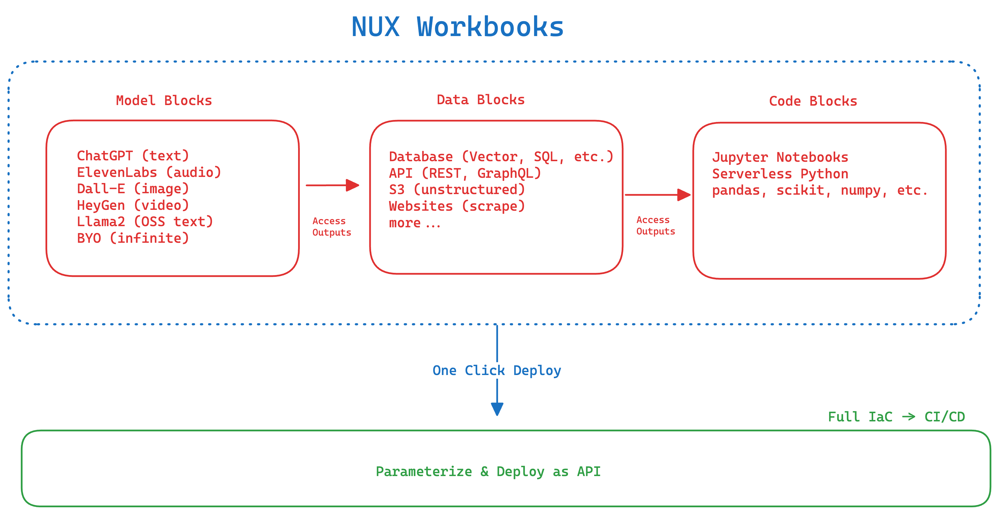

### Workbooks
A NUX Workbook organizes and links blocks within a sequential chain. Think of it like a Jupyter Notebook interface with a Zapier chaining experience that you can then call via API. 

Users can test and experiment workbooks within the NUX Workbook builder then integrate it into their software via API.

Users can supply request parameters when calling their workbook, so that each workbook is fully modular. 

### Blocks
Blocks make up NUX Workbooks. They are capable of performing functions like **code execution**, **model inference**, or **data processing**. Blocks are designed to be interconnected, facilitating the creation of complex, multi-step chains.

The output of each block is accessible across the entire workbook via handlebar tags and standard dot notation: `{{blocks.block_name.key}}`

---

### Model Inference
Model Inference in NUX Workbooks involves using machine learning models for data analysis and predictions. It enables the application of algorithms like language models or image recognition within a workflow. Users can use managed models like GPT and Claude or bring their own like a fine-tuned LLama2 model. 

### Code Execution
The Code Execution Blocks in NUX Workbooks allows for running custom _glue code_. It's often used for data manipulation, transformation, and specific computational tasks. Packages such as _pandas, requests, and scikit_ can be added to a code block. 

### Data Integration
The Data Integration Blocks in NUX Workbooks enables connecting to and using data from different sources. This includes KNN data stores like Weaviate and Pinecone, external APIs (GET & POST), and databases.